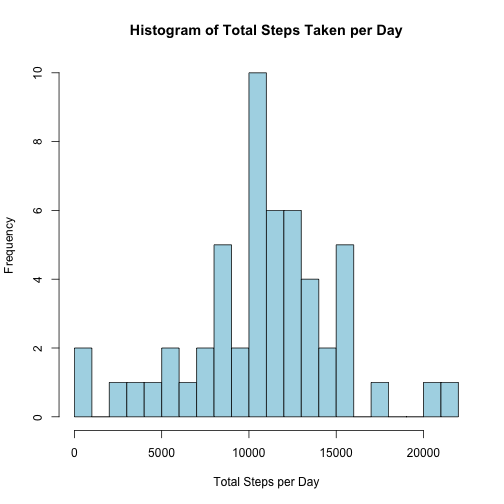
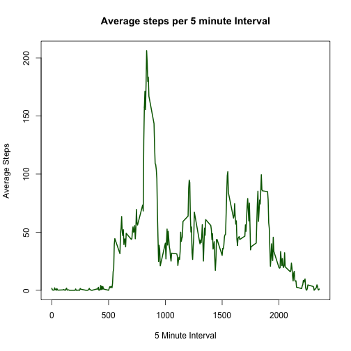
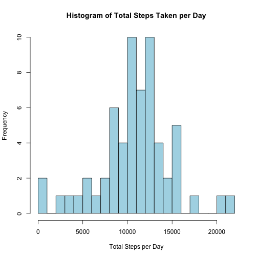
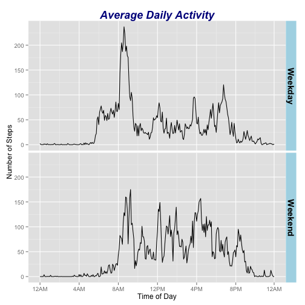

Reproducible Research Course Project One
========================================
## Michael Seelaus  
  
This report analyzes the recorded data from a personal activity monitoring device.  Specifically, the device has recorded the number of steps taken by one individual over 5 minute intervals for two months.  This data has been provided by the course instructors and the raw data is available in the same repository as this report.  
  
### Loading and Preprocessing the Data  
The raw data was loaded with minimal transformations and all necessary packages for the analysis are shown loaded here.  The class for each column was explicitly qualified in order to ensure the date column was loaded into the Date format.  The columns of the dataset were then reordered in order to put the steps value column on the right for ease of reading.  This code will also seach for and download the necessary raw data, if it has not already been downloaded and unzipped into a folder called "data" in your working directory.  


```r
library(plyr)
library(timeDate)
library(ggplot2)
if (!file.exists("./data")) {
        dir.create("./data")
        url <- "https://d396qusza40orc.cloudfront.net/repdata%2Fdata%2Factivity.zip"
        download.file(url, destfile = "./data/activitydata.zip", method = "curl")
        unzip("./data/activitydata.zip", exdir = "./data")
}
activity_data <- read.csv("./data/activity.csv", colClasses = c("integer", "Date", "integer"))
activity_data <- activity_data[c("date", "interval", "steps")]
```
  
### What is the mean total number of steps taken per day?  
In order to get a better feel for the data, we can plot a histogram to show the number of steps taken per day averaged over the two month timeframe.  To do this, I have used tapply to calculate the sum of the steps taken by each date.  Note that I do not use na.rm = TRUE in this case.  When an entire day's intervals are NA, the tapply function will result in a zero sum for that day.  Including those zeros in the plot will distort the histogram.  Since the NA values only occur on days when all of the intervals are also NA, we can leave na.rm = FALSE.  This will return days with a sum of NA.  When plotting the histogram, NA values are ignored.  This method will only work in the situation where NA values occur over entire days and only over entire days (which is true in this case).  


```r
hist(tapply(activity_data$steps, activity_data$date, sum), main = "Histogram of Total Steps Taken per Day", xlab = "Total Steps per Day", col = "Light Blue", breaks = 20)
```

 
  
The mean and median of the average steps taken per day are very similar as can be seen below.  This suggests that the data are likely normally distributed.  As before, we again want the sum function within tapply to include NA values.  If excluded, we would end up with day's showing a zero zum and this would skew the mean and median calculations just as it would have the histogram.  However, once the tapply results are returned, the mean and median calculations must now exclude NAs.  
  

```r
mean(tapply(activity_data$steps, activity_data$date, sum), na.rm = TRUE)
```

```
## [1] 10766.19
```

```r
median(tapply(activity_data$steps, activity_data$date, sum), na.rm = TRUE)
```

```
## [1] 10765
```
  
### What is the average daily activity pattern?  
Another way to explore the data visually is by examining the average number of steps taken over the course of a day.  To see this, tapply is used again except this time to calculate the mean over each interval.  The data is then plotted as a line graph.  


```r
interval_data <- tapply(activity_data$steps, activity_data$interval, mean, na.rm = TRUE)
plot(names(interval_data), interval_data, type = "l", main = "Average steps per 5 minute Interval", xlab = "5 Minute Interval", ylab = "Average Steps", col = "Dark Green", lwd = 2)
```

 
  
The interval with the highest average number of steps is 835 (which corresponds to 8:35AM) and has an average value of 206:  

```r
interval_data[interval_data == max(interval_data)]
```

```
##      835 
## 206.1698
```
  
### Inputting Missing Values  
The number of missing observations (NAs) in the raw data is 2,304.  

```r
sum(is.na(activity_data))
```

```
## [1] 2304
```
  
For inputting missing values, the strategy utilized was to calculate the average steps taken for each interval by each day of the week.  This was selected because simply using the interval average to replace NAs wouldn't be very useful.  The mean and median values would converge and it would increase the peak shown on the histogram.  The assumption is that activity patterns would be variable across different days of the week, but also consistent enough across a sampling of each day of the week that using the average value would be reasonable.  

To accomplish this, the day of the week for each date was added as a new column to the original dataset.  Then, a new complete dataset was created that stripped out the NA values.  This was done in order to calculate the average across each interval and weekday pairing using ddply and summarize on the mean.  The averages data was then merged with the activity data, resulting in the original data (with day of the week) containing a new column representing the interval average for that day of the week.  The next line does the heavy lifting.  We use ddply with mutate across each record and an ifelse statement to replace NA values with the interval and day of the week average.  Finally, the weekday and mean columns are removed resulting in a new dataset that looks like the original except with NAs replaced with the inputted values.  

```r
activity_data$weekday <- weekdays(activity_data$date)
complete_activity <- activity_data[complete.cases(activity_data),]
averages <- ddply(complete_activity, .(interval, weekday), summarize, mean=mean(steps))
activity_revised <- merge(activity_data, averages)
activity_revised <- ddply(activity_revised, .(date, interval, weekday), mutate, steps = ifelse(is.na(steps),mean,steps))
activity_revised <- activity_revised[, c("interval", "date", "steps")]
```
  
We replot the histogram of average steps taken per day using the new dataset with inputted values.  We can see that, as we would expect, a number of the central boxes have increased reflecting the addition of the inputted data.

```r
hist(tapply(activity_revised$steps, activity_revised$date, sum), main = "Histogram of Total Steps Taken per Day", xlab = "Total Steps per Day", col = "Light Blue", breaks = 20)
```

 
  
Recalculating the mean and median shows that the values have now increased.  This suggests that the missing days of data were, on average, more active days of the week.  By adding in the inputted data using the methodology described above, the total daily activity is now higher.  


```r
mean(tapply(activity_revised$steps, activity_data$date, sum))
```

```
## [1] 10821.21
```

```r
median(tapply(activity_revised$steps, activity_data$date, sum))
```

```
## [1] 11015
```
  
### Are there difference in activity patterns between weekdays and weekends?  
Similar to the inputted data methodology, which looked at days of the week, we can analyze the daily activity across weekends versus weekdays.  The mutate function with ifelse was used to add a new column called weekday.  This was then converted to a factor with two levels: Weekday and Weekend.  In order to plot the data across an entire day, the interval column cannot be used.  The interval variable represents a numeric representation (leading zeros dropped) of the 24-hour beginning time of the interval.  For example, 55 represents 0055 or 12:55AM.  The next interval is not 60, but 100 representing 0100 or 1:00AM.  However, since each interval is uniformly 5 mintues we can simply use an integer index for plotting since the values simply need to be equal intervals.  This was done by adding the int column.  The values cycle from 0 through 287 (the total number of intervals each day) and repeats across each day.  
  
We can then plot the data using ddply again to summarize the mean number of steps across the int and weekday variables.  The x-axis must then be appropriately labeled to be meaningful.  Here, I have chosen 4 hour intervals (48 five minute intervals equals 4 hours) and then label them manually.  


```r
new_data <- mutate(activity_revised, weekday = ifelse(isWeekday(date),"Weekday", "Weekend"))
new_data$weekday <- as.factor(new_data$weekday)
new_data$int <- 0:287
graphing <- ddply(new_data, .(weekday, int), summarize, steps=mean(steps))
g <- ggplot(graphing, aes(int, steps)) + geom_line() + facet_grid(weekday ~ .)
g + theme(strip.background = element_rect(fill = "Light Blue"), strip.text.y = element_text(size=14, face="bold"), plot.title = element_text(size=rel(1.5), face = "bold.italic", color = "Dark Blue")) + scale_x_continuous(breaks=c(seq(0, 287, 48),287), labels=c("12AM", "4AM", "8AM", "12PM", "4PM", "8PM", "12AM")) + labs(x = "Time of Day", y = "Number of Steps", title = "Average Daily Activity")
```

 
